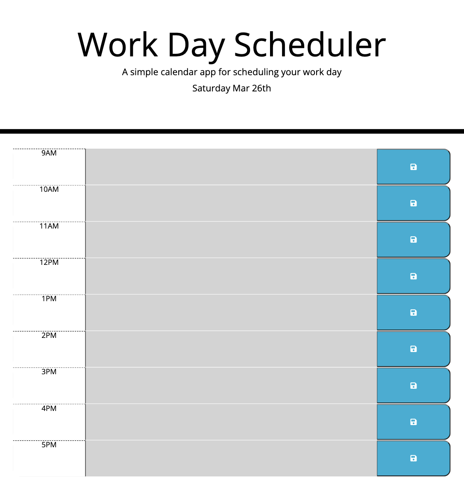

# work-day-scheduler

## Link to live page

https://boopdid.github.io/work-day-scheduler/

## Overview

I created a work day scheduler that allows the user to save events from 9 to 5 of the current day. Times in the past present and future will be siginifed by different colors. The user will be able to save an event by filling the text area and pressing the button to save it to the local storage in the browser.

## Preview

## Tecnologies used

-HTML
-CSS
-JavaScript

In this project i used my knowledge of moment.js and jquery.
